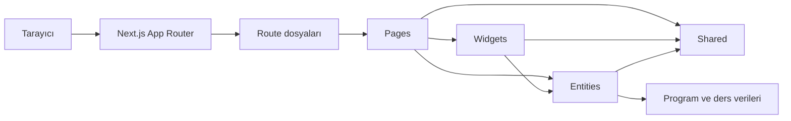

<div align="center">


# KTÜ Ders Bilgi Paketi

### Programları keşfet, müfredatları incele, derslerin ayrıntılarına ulaş.

Karadeniz Teknik Üniversitesi akademik programları için hazırlanmış iki dilli bir ders kataloğu tasarım prototipi.

<br />


</div>

---

> **İşyeri eğitimi projesi** · Bu çalışma, işyeri eğitimi kapsamında verilen KTÜ Ders Bilgi Paketi tasarım projesi için hazırlanmıştır. Bir arayüz ve kullanıcı akışı prototipidir; resmî KTÜ bilgi paketi değildir. Program ve ders içeriklerinin bir bölümü temsilî verilerden oluşur.

## İçindekiler

- [Genel bakış](#genel-bakış)
- [Özellikler](#özellikler)
- [Uygulama mimarisi](#uygulama-mimarisi)
- [Tasarım ilkeleri](#tasarım-i̇lkeleri)
- [Teknoloji yığını](#teknoloji-yığını)
- [Proje yapısı](#proje-yapısı)
- [Uygulama rotaları](#uygulama-rotaları)
- [Başlangıç](#başlangıç)
- [Komutlar](#kullanılabilir-komutlar)
- [Veri ve kapsam notları](#veri-ve-kapsam-notları)

---

## Genel bakış

**KTÜ Ders Bilgi Paketi**, üniversitenin akademik programlarını ve ders bilgilerini tek bir keşif akışında bir araya getiren frontend prototipidir. Kullanıcılar program kataloğunda arama yapıp filtre uygulayabilir, program sayfalarındaki tanıtım bilgilerini inceleyebilir ve dönemlik ders planından derslerin ayrıntılı bilgi paketlerine ulaşabilir.

Arayüz Türkçe ve İngilizce kullanılabilir. Dil tercihi sayfalar arasında korunur. Program ve ders ekranları masaüstü ve mobil görünümlere uyum sağlayacak şekilde hazırlanmıştır.

### Kullanıcı akışı

```text
Program kataloğu  →  Program profili  →  Dönemlik ders planı  →  Ders bilgi paketi
        /                  /programlar/[id]   /ders-plani               /dersler/[code]
```

## Özellikler

### Program kataloğu

- Program adı, İngilizce adı veya program kodu ile arama
- Fakülte / enstitü, öğrenim düzeyi ve öğretim dili filtreleri
- Alfabetik artan ve azalan sıralama
- Sayfalama ve eşleşme olmadığında filtreleri sıfırlama
- Dar ekranlar için açılıp kapanan filtre alanı

### Program profili

- Programın amacı, tanıtımı ve program çıktıları
- Program geçmişi, iletişim ve kariyer alanları
- Sınıf ve dönem seçerek örnek müfredata geçiş
- Ders, kredi, AKTS ve dönem toplamlarının görüntülenmesi

### Ders planı

- Akademik yıl, sınıf ve dönem seçimine göre ders listesi
- Ders kodu üzerinden ders bilgi paketine geçiş
- Zorunlu / seçmeli türü, kredi ve AKTS bilgileri
- Dönem toplamı ve örnek iş yükü hesabı

### Ders bilgi paketi

- Ders amacı, ön koşullar ve haftalık içerik
- Öğrenme kazanımları ve program çıktılarıyla ilişki matrisi
- Ders kitabı ve ek kaynaklar
- AKTS iş yükü ve ölçme-değerlendirme tabloları
- Açılmayan veya kredisiz dersler için bilgilendirme durumları

### Ortak deneyim

- Türkçe / İngilizce arayüz seçimi
- Paylaşılan başlık ve sayfa durum bileşenleri
- Klavye odağı, atlama bağlantısı, etiketler ve ekran okuyucu açıklamaları
- Azaltılmış hareket tercihi için stil desteği
- Mobil ekranlara uyumlu katalog ve ders tabloları

---

## Uygulama mimarisi

Uygulama **Next.js App Router** ile yönlendirilir; ekran ve alan kodları Vettingo-Frontend’de kullanılan **Feature-Sliced Design (FSD)** yaklaşımına benzer şekilde `src/layers` altında gruplanır.



### Katmanların sorumlulukları

| Katman | Sorumluluk |
|---|---|
| **app** | Next.js rotaları, metadata, layout ve hata / yüklenme sınırları |
| **pages** | Bir route’u oluşturan tam ekran bileşenleri |
| **widgets** | Birden fazla ekranda kullanılabilen kapsamlı arayüz parçaları |
| **entities** | Program ve ders alanı modelleri ile prototip verileri |
| **shared** | Uygulamaya özgü olmayan ortak arayüz ve sağlayıcılar |

Bağımlılıklar tek yönde ilerler: üst katmanlar alt katmanları birleştirir. Next.js `app` dosyaları route ve sunucu tarafı parametre işlerini tutar; ekran arayüzü page slice içinde tanımlanır. Page slice’ları `index.ts` dosyaları üzerinden dışa açılır.

### Route ve ekran ayrımı

`src/app` altındaki route dosyaları URL’yi karşılar, parametreleri doğrular, sayfa başlığını üretir ve ilgili page slice’ını çağırır. Örneğin `/programlar/[id]` route’u program kaydını bulur; program ekranının arayüzü `src/layers/pages/program-detail` içinde yer alır.

Bu ayrım, Next.js dosya tabanlı yönlendirmesini korurken ekran kodunu katmanlı mimaride tutar.

---

## Tasarım ilkeleri

### İçeriğe odaklı gezinme

Katalog araması ve filtreleri ilk adımda program bulmayı sağlar. Program profili, ders planına; ders kodu ise doğrudan ilgili ders bilgi paketine bağlanır. Her detay ekranında önceki adıma dönüş bağlantısı ve sayfa yolu bulunur.

### Türkçe ve İngilizce içerik

Dil seçimi ortak sağlayıcı tarafından yönetilir ve `ktu_language` çereziyle saklanır. Program ve arayüz metinlerinde iki dil sunulur. İngilizce ders başlığının olmadığı yerlerde mevcut Türkçe başlık korunur ve kullanıcıya bilgi verilir.

### Ayrı sorumluluklara sahip katmanlar

- Route ve metadata işlemleri `app/` altında kalır.
- Tam ekran bileşenleri `layers/pages/` altındadır.
- Müfredat seçimi, çıktı matrisi ve haftalık içerik gibi büyük arayüz parçaları `layers/widgets/` altındadır.
- Program ve ders bilgileri `layers/entities/` içinde tutulur.
- Ortak başlıklar, dil sağlayıcısı ve genel sayfa durumları `layers/shared/` içinde bulunur.

### Duyarlı ve erişilebilir arayüz

Arayüz mobil ve masaüstü boyutlarında yeniden düzenlenir. Filtre alanı mobilde açılıp kapanabilir; tablolar küçük ekranlarda okunabilir biçimde sunulur. Form kontrolleri etiketlenir, etkileşimli öğelerin klavye odağı görünür tutulur ve sayfalarda ana içeriğe atlama bağlantısı vardır.

### Tutarlı görsel dil

Arayüz KTÜ’nün lacivert ve mavi tonlarını, yüksek kontrastlı içerik kartlarını ve Geom yazı tipini kullanır. Başlık, kart, tablo ve boş durum stilleri aynı görsel sistem içinde tutulur.

---

## Teknoloji yığını

| Alan | Teknoloji |
|---|---|
| **Framework** | Next.js 16.3.6 |
| **Arayüz kütüphanesi** | React 19 |
| **Dil** | TypeScript 5 |
| **Stil altyapısı** | Tailwind CSS 4 ve CSS Modules |
| **Yönlendirme** | Next.js App Router |
| **Lint** | ESLint 9 |
| **Paket yöneticisi** | npm |
| **Mimari** | Feature-Sliced Design yaklaşımı |

---

## Proje yapısı

```text
03-prototip/
├── public/
│   ├── brand/                    # KTÜ marka görseli
│   └── fonts/                    # Geom yazı tipi ve lisans bilgisi
├── src/
│   ├── app/                      # Route’lar, layout ve global stiller
│   └── layers/
│       ├── pages/
│       │   ├── catalog/
│       │   ├── program-detail/
│       │   ├── curriculum/
│       │   └── course-detail/
│       ├── widgets/
│       │   ├── curriculum-selector/
│       │   ├── outcome-matrix/
│       │   └── weekly-content/
│       ├── entities/
│       │   ├── program/          # Program modeli ve tanıtım verileri
│       │   └── course/           # Ders modeli, içerikleri ve müfredat
│       └── shared/
│           ├── providers/        # Dil sağlayıcısı
│           └── ui/               # Ortak başlıklar ve sayfa durumları
├── next.config.ts
├── package.json
├── package-lock.json
└── tsconfig.json
```

`@/` import alias’ı `src/` dizinine karşılık gelir. Örnek: `@/layers/pages/catalog`.

---

## Uygulama rotaları

| Rota | Açıklama |
|---|---|
| `/` | Program kataloğu, arama, filtreleme ve sıralama |
| `/programlar/[id]` | Program tanıtımı ve müfredat seçimi |
| `/programlar/[id]/ders-plani` | Akademik yıl, sınıf ve döneme göre ders planı |
| `/dersler/[code]` | Ders bilgi paketi |

Ders planı route’u `academicYear`, `year` ve `term` sorgu parametrelerini kabul eder:

```text
/programlar/[id]/ders-plani?academicYear=2025-2026&year=1&term=fall
```

`term` değeri `fall` veya `spring` olabilir. Geçersiz program, sınıf, dönem veya akademik yıl için bulunamadı sayfası gösterilir.

---

## Başlangıç

### Gereksinimler

- [Node.js](https://nodejs.org/) — güncel LTS sürümü önerilir
- npm
- Git

### Depoyu klonla

```bash
git clone https://github.com/emreucbudak/ktu-ders-bilgi-paketi.git
cd ktu-ders-bilgi-paketi
```

### Bağımlılıkları yükle

Kilit dosyasına göre kurulum:

```bash
npm ci
```

veya:

```bash
npm install
```

### Geliştirme sunucusunu başlat

```bash
npm run dev
```

Uygulama [http://localhost:3000](http://localhost:3000) adresinde açılır.

### Üretim derlemesi

```bash
npm run build
npm start
```

---

## Kullanılabilir komutlar

| Komut | Açıklama |
|---|---|
| `npm run dev` | Geliştirme sunucusunu başlatır |
| `npm run lint` | ESLint statik analizini çalıştırır |
| `npm run build` | Optimize edilmiş üretim derlemesini oluşturur |
| `npm start` | Üretim sunucusunu çalıştırır |

---

## Veri ve kapsam notları

- Bu depo frontend tasarım prototipidir; backend veya öğrenci bilgi sistemi entegrasyonu içermez.
- Program, müfredat ve ders bilgileri proje içinde örnek veri olarak tanımlanmıştır.
- İçerikler resmî, eksiksiz veya güncel akademik kayıt yerine geçmez.
- İngilizce karşılığı bulunmayan bazı dersler Türkçe başlıkla gösterilir.
- Dil tercihi `ktu_language` çereziyle saklanır.
- Geom yazı tipi lisans bilgisi [`public/fonts/OFL.txt`](./public/fonts/OFL.txt) dosyasındadır.

---

<div align="center">

**İşyeri eğitimi kapsamında hazırlanmış bir KTÜ Ders Bilgi Paketi tasarım prototipi.**

</div>
